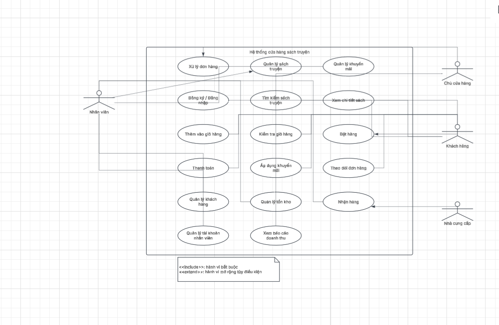

Hệ thống cửa hàng sách truyện
Trinh Van Diep
1. Giới thiệu bài toán
   Hệ thống cửa hàng sách truyện được xây dựng nhằm tự động hóa quy trình quản lý bán hàng, tra cứu sách, xử lý đơn hàng và quản lý vận hành nội bộ của cửa hàng, giúp nâng cao chất lượng phục vụ khách hàng và tối ưu hóa hiệu suất quản lý cho chủ cửa hàng cũng như nhân viên.
2. Các tác nhân và vai trò trong hệ thống
Khách hàng:
   Thực hiện đăng ký/đăng nhập tài khoản.
   Tìm kiếm sách truyện, xem chi tiết sách.
   Quản lý giỏ hàng (thêm sách, kiểm tra giỏ hàng) và tiến hành đặt hàng.
   Áp dụng mã khuyến mãi, thanh toán đơn hàng, theo dõi tiến trình đơn hàng và xác nhận nhận hàng.
Nhân viên:
   Hỗ trợ đăng ký/đăng nhập, thực hiện thêm sản phẩm vào giỏ hàng và xử lý thanh toán thay cho khách hoặc hỗ trợ trực tiếp.
   Thực hiện chức năng xử lý đơn hàng.
Chủ cửa hàng (Quản lý):
   Quản lý sách truyện, quản lý khuyến mãi, quản lý khách hàng, quản lý tồn kho.
   Quản lý tài khoản nhân viên và xem báo cáo doanh thu của cửa hàng.
Nhà cung cấp:
   Tác nhân ngoài hệ thống tham gia vào quy trình giao/nhận hàng (Nhận hàng).\
3. Các chức năng cốt lõi (Use Cases)
Nhóm Quản lý mua sắm của Khách hàng:
   Đăng ký và Đăng nhập hệ thống.
   Tìm kiếm sách truyện, xem thông tin chi tiết.
   Thêm sản phẩm vào giỏ hàng và kiểm tra giỏ hàng.
   Đặt hàng, áp dụng khuyến mãi, thanh toán và theo dõi đơn hàng.
Nhóm Vận hành và Xử lý nghiệp vụ (Nhân viên & Chủ cửa hàng):
   Xử lý đơn hàng, nhận hàng.
   Quản lý danh mục sách truyện, quản lý kho (tồn kho).
   Quản lý khách hàng, quản lý chương trình khuyến mãi.
   Quản lý tài khoản nhân viên và xem hệ thống báo cáo doanh thu.

